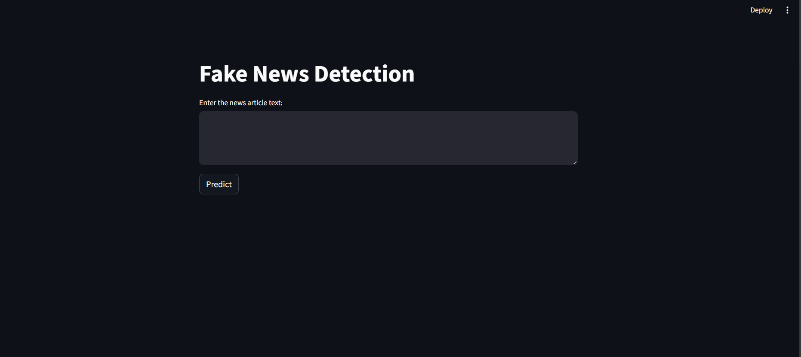
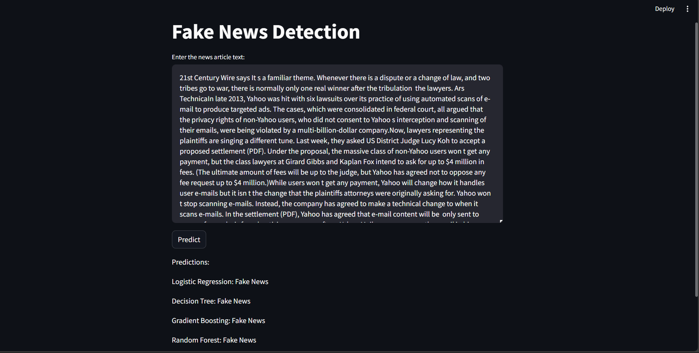
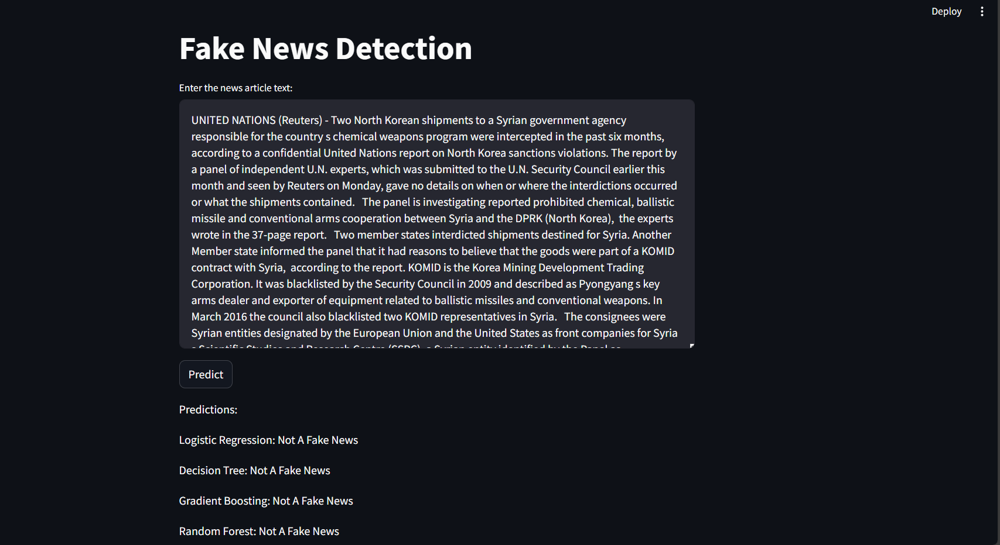

# Fake News Detection App

This application detects fake news using machine learning models. Built with Streamlit, it allows users to input news article text and get predictions on whether the news is fake or not.

## Technologies Used:

- **Python**
- **Streamlit**
- **Pandas**
- **NumPy**
- **Scikit-learn**
- **Seaborn**
- **Matplotlib**
  
## Machine Learning Models used:
- **Logistic Regression**
- **Decision Tree**
- **Random Forest**
- **Gradient Boosting**
  
## App (Screenshots)

